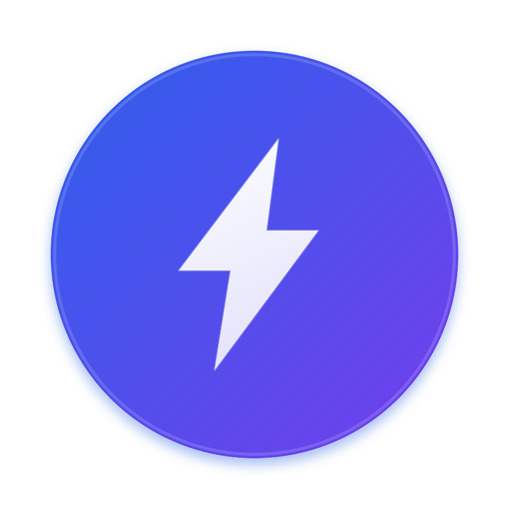

<p align="center">
  
</p>

<h1 align="center">VoltYTM</h1>

<p align="center">
  A native desktop client for YouTube Music.<br/>
  Built with Tauri v2 + Rust. Fast, lightweight, and feature-rich.
</p>

<p align="center">
  <a href="#features">Features</a> &bull;
  <a href="#download">Download</a> &bull;
  <a href="#plugins">Plugins</a> &bull;
  <a href="#development">Development</a> &bull;
  <a href="#license">License</a>
</p>

> **Disclaimer** — VoltYTM is an independent, unofficial application. It is not affiliated with, authorized by, endorsed by, or connected to Google LLC or YouTube in any way. "YouTube Music" is a trademark of Google LLC. This software is provided "AS IS" without warranty. See [License](#license) for full terms.

---

## What is VoltYTM?

VoltYTM is a standalone desktop application that wraps YouTube Music in a native webview, delivering a clean, fast experience with built-in plugins for lyrics, playback control, scrobbling, and more. It runs natively on Windows, macOS, and Linux without the overhead of a full browser.

## Features

### Playback & Audio

- **Synced Lyrics** — Real-time time-synced lyrics displayed alongside playback, powered by multiple lyrics databases
- **Playback Speed** — Slow down or speed up any track from 0.25x to 3x with pitch preservation
- **Crossfade** — Smooth audio transitions between tracks for gapless playback
- **Volume Normalization** — Automatic loudness normalization to keep volume consistent across tracks
- **Skip Silence** — Automatically fast-forwards through silent sections of tracks
- **Sleep Timer** — Set a countdown timer or stop playback at the end of the current track

### Integrations

- **Discord Rich Presence** — Show what you're listening to on your Discord profile with album art and timestamps
- **Last.fm Scrobbling** — Automatic track scrobbling with configurable progress threshold
- **SponsorBlock** — Skips sponsored segments, intros, outros, and other community-reported sections
- **Native Notifications** — Desktop notifications when a new track starts

### UI & Controls

- **Picture-in-Picture** — Floating mini player that stays on top of other windows
- **Mini Player** — Compact floating panel with album art, track info, and playback controls
- **Audio Output Picker** — Switch between speakers, headphones, and Bluetooth devices
- **Key & BPM Detection** — Real-time analysis displaying the musical key and BPM of any track
- **Navigation Controls** — Back/forward browser-style navigation buttons
- **Compact Sidebar** — Condensed sidebar layout for a cleaner interface
- **Unobtrusive Player** — Player bar dims when idle, restores on hover

### Themes & Customization

- **Built-in Themes** — Dark, AMOLED, Catppuccin Mocha, and Gruvbox
- **Custom CSS Themes** — Load your own themes from the settings panel
- **Configurable Plugins** — 23 built-in plugins, all toggleable from settings

### Privacy & Performance

- **Do Not Track** — Privacy headers and tracker blocking
- **Skip Disliked** — Auto-skip tracks you've thumbs-downed
- **Disable Autoplay** — Pause on track change instead of auto-playing
- **Lightweight** — Native performance with Tauri v2, no Electron overhead

## Download

Visit the [Releases](https://github.com/rixabhh/VoltYTM/releases) page to download the latest version for your platform.

| Platform | Format |
|---|---|
| Windows | `.msi` installer |
| macOS | `.dmg` (Apple Silicon + Intel) |
| Linux | `.deb`, `.AppImage` |

### Requirements

- **Windows**: WebView2 Runtime (usually pre-installed on Windows 10/11)
- **macOS**: macOS 10.15 or later
- **Linux**: `libwebkit2gtk-4.1-0` and `libayatana-appindicator3-1`

## Plugins

VoltYTM ships with 23 built-in plugins. All can be toggled on or off from the settings panel.

| Plugin | Description | Default |
|---|---|---|
| Synced Lyrics | Time-synced lyrics display | On |
| Crossfade | Smooth transitions between tracks | Off |
| Playback Speed | 0.25x–3x speed with pitch control | On |
| Key & BPM | Musical key and tempo detection | Off |
| Discord RPC | Discord Rich Presence integration | Off |
| Last.fm | Track scrobbling | Off |
| SponsorBlock | Skip sponsored segments | On |
| Notifications | Desktop notifications on track change | On |
| Sleep Timer | Countdown or end-of-track stop | On |
| Audio Device | Switch audio output devices | On |
| Volume Normalizer | Automatic loudness normalization | Off |
| Mini Player | Compact floating player panel | On |
| Picture-in-Picture | Native PiP mode | On |
| Skip Silence | Fast-forward silent sections | Off |
| Do Not Track | Privacy headers and tracker blocking | On |
| Disable Autoplay | Pause on track change | Off |
| Skip Disliked | Auto-skip thumbs-down tracks | Off |
| Compact Sidebar | Condensed sidebar layout | Off |
| Navigation | Back/forward browser buttons | On |
| Unobtrusive Player | Dim player bar when idle | Off |
| Theming | Dark, AMOLED, Catppuccin, Gruvbox | On |

## Development

### Prerequisites

- [Node.js](https://nodejs.org/) 22+
- [pnpm](https://pnpm.io/) 9+
- [Rust](https://rustup.rs/) 1.85+
- Platform-specific dependencies (see [Tauri prerequisites](https://v2.tauri.app/start/prerequisites/))

### Setup

```bash
git clone https://github.com/rixabhh/VoltYTM.git
cd VoltYTM
corepack enable
corepack pnpm install
```

### Run in Development

```bash
corepack pnpm tauri dev
```

### Build for Production

```bash
corepack pnpm tauri build
```

### Run Tests

```bash
corepack pnpm run test
cargo test --manifest-path src-tauri/Cargo.toml
```

### Project Structure

```
VoltYTM/
├── src/                    # Svelte frontend (settings UI)
├── src-tauri/              # Rust backend
│   ├── src/                # Rust modules (adblock, proxy, commands, etc.)
│   ├── scripts/init.js     # Injected into YouTube Music page
│   ├── themes/             # Bundled CSS themes
│   └── tauri.conf.json     # Tauri configuration
├── tests/                  # Frontend tests
└── .github/workflows/      # CI/CD pipelines
```

## License

MIT License — see [LICENSE](LICENSE) for full text.

**No Affiliation** — This project is not affiliated with, authorized by, or endorsed by Google LLC or YouTube. "YouTube Music" is a registered trademark of Google LLC. This application is provided "AS IS" without warranty of any kind. The developers and contributors accept no liability for any claims, damages, or other liability arising from the use of this software.
